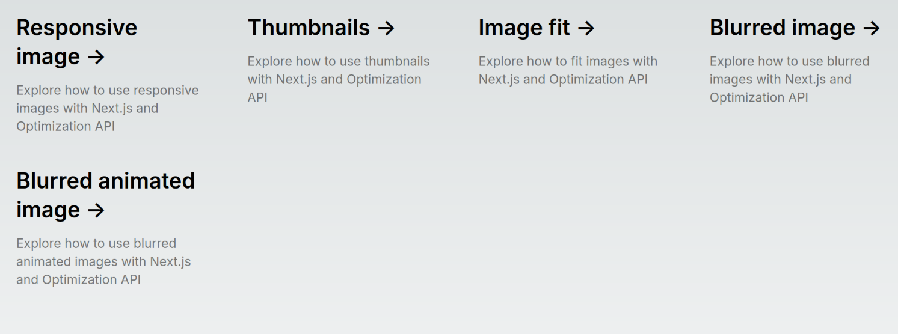
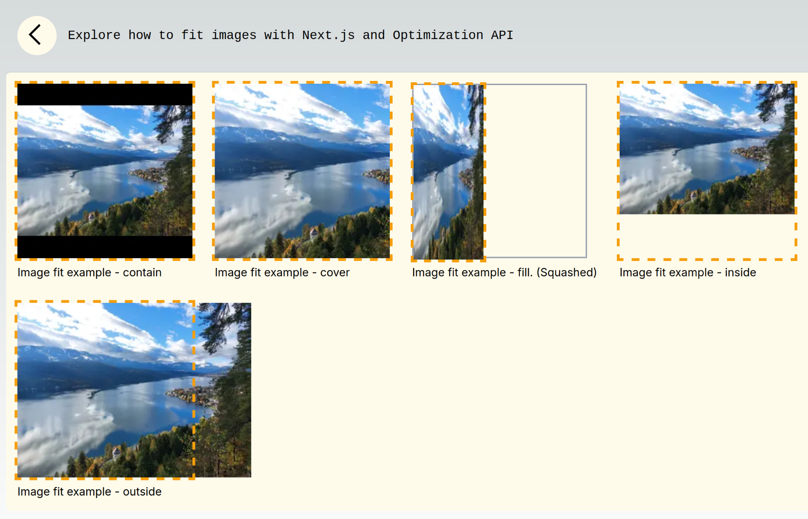
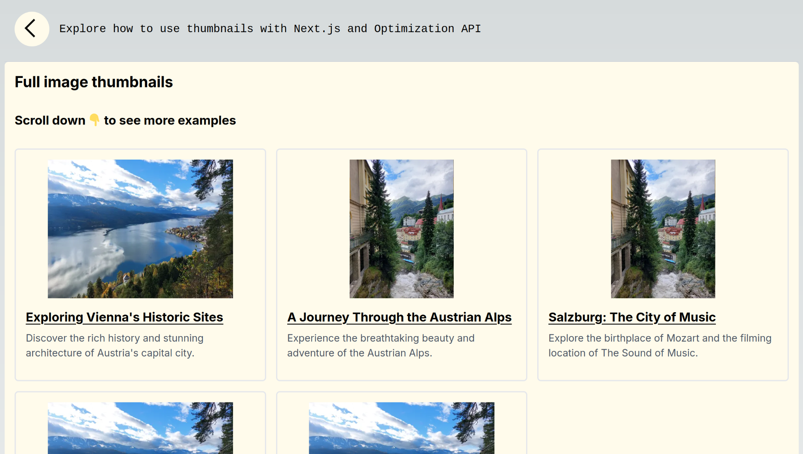

# nextjs-remote-images

Example static web app, that uses remote image optimization service

## Screenshots

Demo URL: [https://nextjs-remote-images.examples.oleksiipopov.com/](https://nextjs-remote-images.examples.oleksiipopov.com/)

Landing page:



Thumbnails with different "fit" parameters:


Thumbnails with loading blur animation:



## How to run

```bash
# Inastall dependencies of all workspaces
npm run install-all

# Run the front-end in dev mode
npm run dev-front
```
